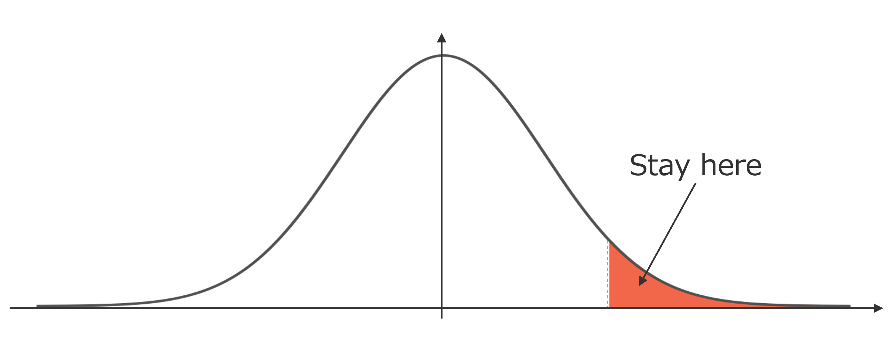

<div align="center">
  <br>
  
</div>

<h4 align="center">Lies, damned lies, and statistics <br> <i>—Chapters from My Autobiography</i></h4>

<div align="center">
  
  
  
  
</div>

# setup
Install [Rye](https://rye-up.com/) and run the following command.

```bash
$ rye sync
```

# Statistics Study
統計学の基礎的な内容を学ぶためのコードをまとめる。

# Contents

## Unbiased and Consistent estimator
$X \sim N(\mu, \sigma^2)$ に従う母集団からの標本$X_1, X_2, \cdots, X_n$を用いて$S=\mu^2$の推定量を以下の3通りの方法で求める。

1. $S_1 = \frac{1}{n}\sum_{i=1}^{n} {x_i}^2$
2. $S_2 = \bar{X}^2$
3. $S_3 = \bar{X}^2 - \hat{U^2}/n$

### 実行方法
```bash
# For Rye users:
$ rye run python src/unbiased_consistent_estimator/unbiased_consistent_estimator.py

# For those not using Rye:
$ python src/unbiased_consistent_estimator/unbiased_consistent_estimator.py
```

### 実行結果
figs/unbiased_consistent_estimator 以下に各推定量ヒストグラムが保存される。

## Missing Data
欠損データの欠損メカニズムと、補完方法についてのシミュレーションを行う。欠損メカニズムに対して、各種補完方法を用いるとどのような偏りが生じるかを図で確認する。

欠損メカニズムは以下の3つを実装。
- MCAR(Missing Completely At Random): 完全にランダムに欠損が発生する
- MAR(Missing At Random): 他の変数に依存して欠損が発生する
- MNAR(Missing Not At Random): 欠損の発生が欠損値自体に依存している

補完方法として以下の2つを実装。
- 平均値で補完
- 回帰分析による補完

### 実行方法

```bash
# For Rye users:
$ rye run python src/missing_data/missing_fill.py

# For those not using Rye:
$ python src/missing_data/missing_fill.py

```

### 実行結果
figs/missing_fill 以下に各欠損メカニズムと補完方法の結果が保存される。


